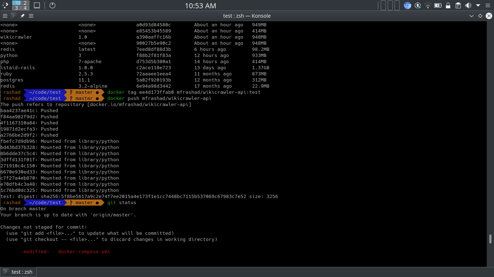
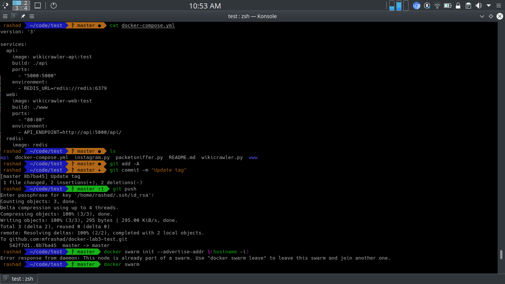
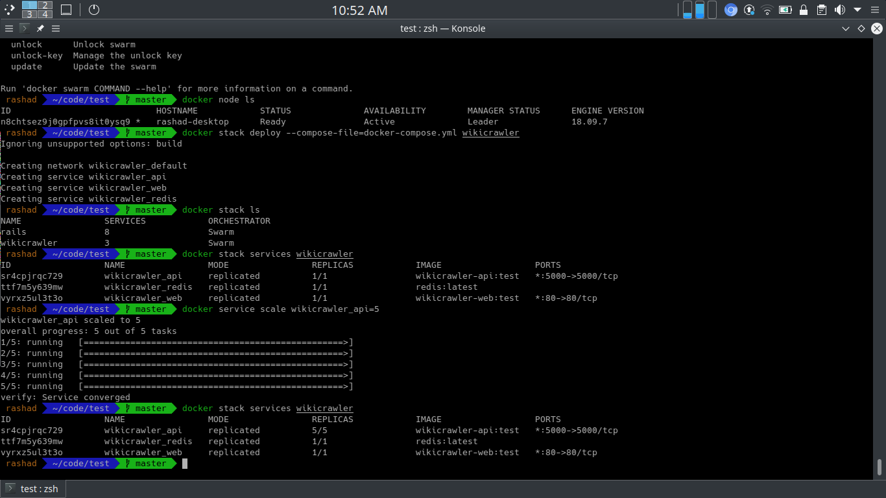
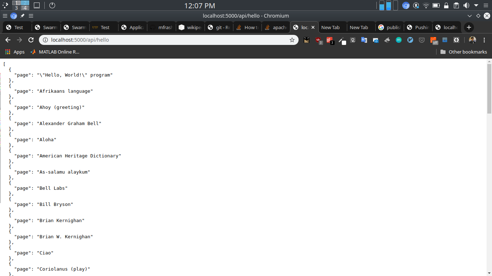

# Lab 3 Test : Docker

Student: Muhammad Fathy Rashad 25547


## Setup
Install `docker` and `docker-compose`

```
$ docker-compose up -d --build
```

## Usage
```
http://localhost:5000/api/<search_input>
```

## Example
```
http://localhost:5000/api/hello
```

will return

```
[
  {
    "page": "\"Hello, World!\" program"
  },
  {
    "page": "Afrikaans language"
  },
  {
    "page": "Ahoy (greeting)"
  },
  {
    "page": "Alexander Graham Bell"
  },
  ...
]
```

## Screenshots



